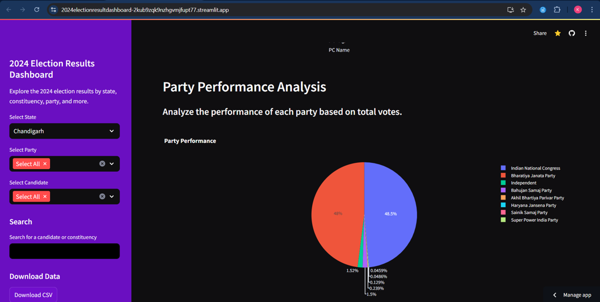
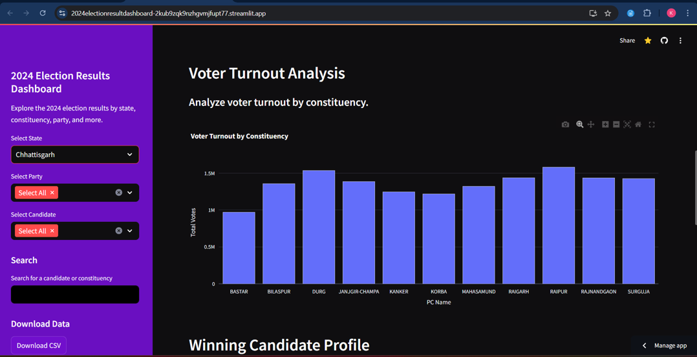
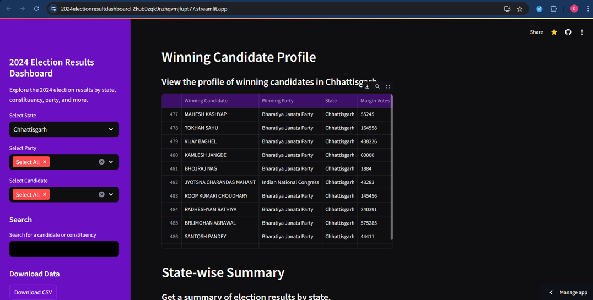
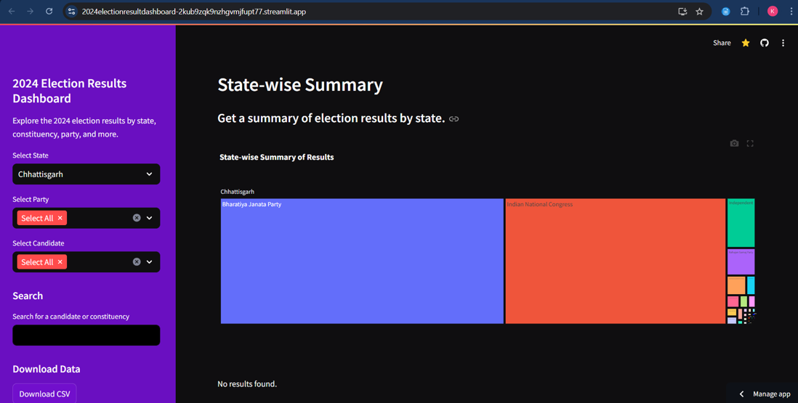
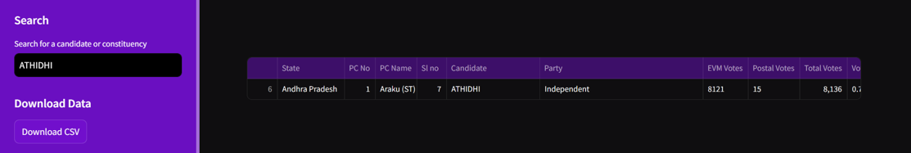
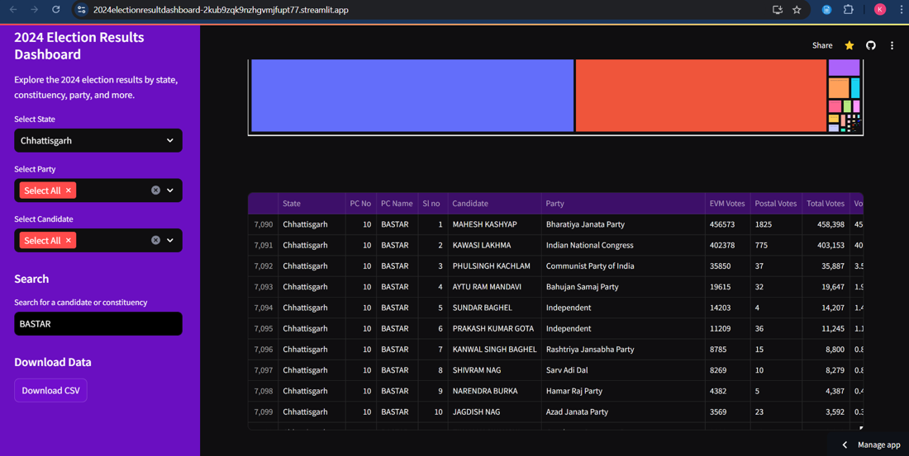
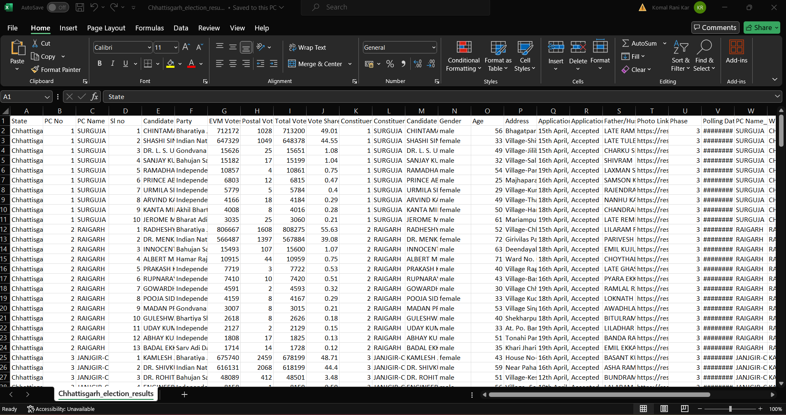

# 2024 Election Results Dashboard

## Overview
This project is a web-based dashboard built using Streamlit to visualize and analyze the results of the 2024 elections. The dashboard provides an interactive way to explore election data by state, constituency, party, and candidate, offering insights into voting patterns, candidate performance, party success, and more.

## Features
- **State and Constituency-Level Analysis**: Explore election results filtered by state and constituency. Visualize the total votes received by candidates, broken down by party.
  

- **Party Performance**: Analyze the overall performance of political parties based on the total votes they received.

- **Voter Turnout**: Understand voter turnout by constituency, providing insights into electoral engagement.

- **Winning Candidate Profiles**: View detailed profiles of winning candidates, including their party affiliation and margin of victory.

- **State-Wise Summary**: Get a summary of election results for each state, with an aggregated view of party performance.

- **Search Functionality**: Search for specific candidates or constituencies to quickly access relevant election data.

- **Data Download**: Download filtered election data as a CSV file for further analysis.

##Deployment
[Link Text](https://2024electionresultdashboard-2kub9zqk9nzhgvmjfupt77.streamlit.app/)

## Requirements
- **Python 3.x**
- **Streamlit**
- **Pandas**
- **Plotly**

